# Work Log

## #64

Finished the work necessary to make the vote action work without side effects
now. Now that that is working I can put focus on actual refactoring of the
system in the ways that it needs to work. There are a lot of places where
standards would clear things up. I think I'm going to stop here for now and
think on things for a clear path forward. And I'm exhausted.

## #63

Slowly getting back into things as I was emotionally blocked from moving forward
because of how difficult things were to track down and realize what was wrong. I
need to sit down and refactor so many things to get things smooth again. But for
now, just small things. I started by making errors easier to track down using
pretty-error. I never had a handler for unhandled promises before, but now I
do... so that definitely helps. Didn't even realize I needed one. So now it
should be much easier to track down issues. Next I need to explore finishing up
this initial vote system and then when that is done, start cleaning up the
domain model to make actually proper sense. In particular the first thing I want
to do is flatten the player model across the database. Break time!

## #62

Essentially the same as the prior session as I did a double. It was absolutely
painful.

## #61

I spent so long debugging the chain of events in order to properly get things
working and it was just utterly painful. I need to re-think the entire
entity/context system to make sure that it doesn't create this much pain moving
forward. I ended up doing essentially a double session because it was
complicated and I spent so much time debugging. Another problem is that the
error logging just wasn't there and I had to manually track down each error
without a stack trace which is utterly painful. It might be babel-node it might
be something else. I just don't want to suffer like that again.

## #60

Finally got the voting trigger started now I need to handle the voting domain
action in order to start creating a ranked list. This will probably involve some
interesting things and I'm looking forward to it. After that the final thing
will be creating a winner trigger and that will start a new round and hopefully
properly start the entire cycle all over again.

## #59

Got slowly back into things by trying to make the voting system trigger properly
with a candidates list. Took a bit to figure out something, but I gotz it now.
Next is to create a new database trigger for the voting system.

## #58

Refactored the populate candidates script... I was definitely right in how
complicated it was and it really needed to happen and I snagged a couple of new
entity management functions out of it like handling candidates. But now I'm good
and I don't want to touch it no more. Next is to tackle the domain again and
handle the voting system. Should be fun and hopefully next block I'll have a
finished domain that I can play from the ground up. Looking forward to it, for
now it is break time.

## #57

Cleaned up two of the dev scripts with the entity system. The biggest most
complicate dev script however is still yet to come so I'll spend the entire next
session refactoring that. Which I'm not really looking forward to, but it needs
to be done. I was really hoping to continue the domain development for voting
this block, but probably not going to happen since I need this refactoring to go
forward.

## #56

Well the whole trigger system is now in compliance with the entities system
which is awesome. I still need to refactor a complicated system used for hands
for players, but it should be good. I also need to refactor the facebook library
to be able to handle messages to multiple leads which includes transforming
messages properly. But for now I should move on. I think I should still spend a
session refactoring the dev scripts so I go into the final session with a
completely cleaned up dev script system. Mainly because the dev scripts might
just get more complicated due to being deeper in the relationship chain and use
cases.

## #55

Went in to start putting the entities system into place and ran into needing to
refactor the triggers properly. I believe I'll eventually have the triggers go
through the same backbone as the rest of the system, but right now I have to
slowly refactor it into a clean entities system. The plan is to use the "action"
and "payload" system to properly setup the context and then use the domain to
determine the messages and then divulge out into side effects. Seems to be an
emerging pattern, that will happen soon. For now, probably a whole nother round
of refactoring.

## #54

Did some serious re-thinking of how I'm accessing the entities database both in
gathering context as well as saving side effects and found a much cleaner way to
write the system and I'm actually very happy with how it came out. I think
eventually it will lead to a very strong way to define domain relationships in
the far future, but that is kind of too forward thinking for now. Just going to
take my deep block break so I'll be back in like an 2.5 hours.

## #53

Finally finished this ridiculously complicate dev script to populate random
picks for each player selected. But it works now and I'm happy with it. Next
thing to do is actually create the candidate list to trigger the start of
voting. But I think I really need to spend some time trying to refactor the dev
scripts, the context, and a couple other things mainly dealing with cleaning up
fetching and storing in the database because there is a lot of very difficult to
read closures everywhere.

## #52

This is a complicated dev script that I'm working on as it involves a lot of
relationships. I've got it selecting the goal to populate and now asking which
players to populate with and then I need to grab their hands and remove a random
card from it and add it as a candidate for that round. Tis sooo much work, but
it should be valuable.

## #51

Did sort of a warm up session by just looking around and updating emojis on all
of the cards to spruce it up a bit and add some motivation. Also started work on
a script that will help me populate candidates quickly from player hands, this
will be huge to speed up the manual testing portion. And then after that script
I'll be working on the voting system. Of to a break for my first session.

## #50

Got several scenarios with picking cards covered. Still gotta do some side
effects for picking a card, especially for voting and stuff, but I'm really
close now. Going to finish for the night and I'll pick all this up in the
morning. The domain is going smoothly, I should easily be able to finish the
core logic tomorrow with 3 deep blocks available. Looking forward to it.

## #49

Setup the system to handle multiple games now and setting up all of the
individual actions to be game and round based where necessary so we can start
handling situations where a player tries to pick from early in the chat history.
Next I'll be working on making sure that we are collecting all of the candidates
that are necessary for a vote and if that goes smoothly then I'll start working
on the voting system. The next session is the last in this deep block until
tomorrow morning. Hopefully I get a good amount done.

## #48

Fixed up the round side effects and I am now storing the goal for the round that
is picked from the black deck. I also setup the pick action to work
appropriately. I still need to save the side effects for the pick action to
start the candidate voting process. I think next round I need to invest in
managing multiple games so I can scale a bit easier.

## #47

Did some simple refactoring here and there. Moved triggers to their own files
added some emoji to the goals. Added a show hand button to the goals. Added a
pick payload to prepare for actual picking. Next I'll work on Round side effects
which means making the black deck work.

## #46

Created a script to create the white and black decks for the game. Also setup
the hand creation to grab random white cards for each player's hand. Still have
to setup a discard pile to keep track of on a per game basis, but for the most
part we should be good. Taking my deep block break. Be back in at most a few
hours.

## #45

Setup the initial round started trigger as well as setup a script that will
allow me to delete a game real quickly whenever I so choose. Was actually really
quick. Next thing to do is handle all of the side effects from rounds being
created and then perhaps start working on the deck management and discard pile
management to show some dynamic hand creation.

## #44

Refactored out the triggers so it doesn't bloat the index file. I also added the
show hand domain service, it took no time at all which is awesome. And I also
finished up the additional side effects that games create which includes
creating a round and next is to start doing the round creation portion and doing
everything for that. BREAK TIME!!!

## #43

Modified the populate queue dev script to read from the database and add
directly from there instead using inquirer to allow the dev to choose users to
add. Then also changed the property on the game object to notified players
instead of accepted players to make more sense for the domain. Next I'll be
making sure I create the things that need creating when a game starts next like
a hand for each player and a round.

## #42

WOOT!!! I got sending a message to every other player working properly after a
database trigger of a new game happening. I had to debug a lot because I didn't
think about a missing feature in the Node.js version on Google Cloud Functions.
I had to replace Object.values with lodash.values instead to act as a polyfill.
It also doesn't update the game with the accepted players which needs to happen.
The code ultimately is fairly sloppy and I think there is a better way to do it
with transmutation, but this is a huge step up so I'm satisfied. First
multiplayer functionality is awesome.

## #41

I started re-organizing to prepare for a database cloud function, and then just
got sucked into refactoring in ALL the places. Was a lot of fun cleaning up and
removing lodash where I could. The only thing I'm dependent on lodash for now is
the has function which uses a json path for checking an object's existence. I
might make a utility for that later to remove lodash as a dependency from the
project. So next is setting up the database trigger to work as we need it to for
messaging other players.

## #40

Finished up the enriching of user profile data as well as used that data to
populate the game started message that is being sent back to the lead. Also
added in some logic that would filter out the lead player that this was being
sent to.

## #39

Did a bunch of refactoring to remove dependencies. I no longer require an
external dependency for messaging in fb messenger now. I also removed lodash
from being needed in the firebase db lib. Refactored how we were doing some of
the Facebook message sending and removed a thing I didn't need. And next I'll
start working on the fetching of profile information.

## #38

Spent time to setup a dev script to populate the queue so it is easy to fill it
with the test accounts and make a new game. Should speed up my development and
will allow me to add more test scripts moving forward in the future. Done for
the night, but tomorrow I will start working on actual game logic now that the
queue system is actually working. At first I will start by enriching the lead
data and adding it after every login. Night for now. I'm still on track to
finish this weekend as long as I get 3 deep blocks in tomorrow and probably
another 2-3 deep blocks on Sunday.

## #37

Had to go through the motions and get everything setup to test adding all
players to a game, which was a hassle, but I discovered a few things that needed
changing like adding a test githook which is definitely needed. Next I need to
start extracting profile information for each lead and updating it regularly so
the information can be used for messages like player names for when a game is
started. So next I'll start working on enriching leads.

## #36

Had to sit down and create email accounts for 4 additional "players". Took a
while to do and then I created facebook accounts for them and added them as
testers. I also realized that I needed logic for when a player doesn't exist yet
so I also added that. I'll finish up the testing for joining the queue next.

## #35

Started fleshing out the domain started with joining a queue. Not too bad so
far, but right now I'm trying to figure out exactly how I want to handle these
things. Mainly because right now I'm trying to figure out if I want a database
trigger for joining the queue or just handle it as soon as the event comes in.
I'll figure it out on my break.

## #34

Setup the payloads for the menu items, quick replies, and postback buttons to
use yaml since JSON is not supported as any sort of double quotes in the
persistent menu won't work. So YAML is cleaner anyway and more succinct it
should work out perfectly fine. I still have to figure out the actual dumping of
yaml when using transformers to make the postback buttons for cards, but that
shouldn't be too bad. Done with this deep block and next is to dive, for real
this time, into the domain in the afternoon.

## #33

So I refactored the login action in the domain into its own file now and I'm
using babel wildcard to load it in. Refactored a few things around that to make
everything just a tad cleaner as we move forward. I wanted to get rid of
transmutation wherever I could and fallback to true functions. Next I'm going to
refactor the quick replies and the payloads in general to handle not just action
type but also payloads for the action. Started playing around with that at first
and then broke all the things.

## #32

Re-added the saving of the context after the domain rules kick in. Explored
things that need to be added to transmutation to make sure that it can clean up
our code a bit and be more declarative. Next is to get back to tackling the
actual domain rules so next will be adding players to the queue and hopefully my
current logic around context management holds up for everything moving forward.

## #31

Refactored the domain stuff to do proper unit testing instead of injecting the
database. We should be gathering the context on a per action basis prior to
calling the domain logic, then afterwards saving the context that needs to be
saved based on what the domain spits out. Next I just have to replicate the
saving portion and it should be all good to get back into domain logic again.

## #30

Figured out a solid way to do some error handling type checking. So now on login
if you already have a player then it will welcome you back instead of doing a
regular welcome for new players. I also did a bit of refactoring to make it a
tad cleaner. I've removed the start stub message and the goal will be to
completely remove all of the stub messages to ensure that we have completed the
domain.

## #29

Another painful session of trying to get things working with transmutation the
first go around. Since it is a new package that I designed and haven't used as
much in the field yet I'm still trying to figure out the best patterns to use
for it. I think ultimately with modifications it will work out, but it is still
a very painful process as I try to learn everything.

## #28

Painfully setup the testing system. I don't know why I'm so terrible at it and
it hurt my brain for now reason. Anyways, now I have a decent pattern to go by
so time to move forward with that and start fleshing out the domain.

## #27

Finished the last of the messages. They are now all domain messages rather than
facebook based messages. So the domain is now setup to be handled dynamically by
the facebook system so should be fairly easy to do the domain now and expect
clean output. WOOT!! So happy to be done with that.

## #26

I'm painstakingly going through the messages file and changing everything to a
domain message that can be worked with so when I actually start doing domain
coding it will be dynamic.

## #25

Started doing some refactoring for the facebook code and got decently far. Still
have some to go and I need to change it to transform based on domain event types
rather than what we are currently doing. Quick break.

## #24

Finally got back into things. I had to take like a 3 hour break in order to rest
up as I worked way too hard yesterday squeezing out 18 sessions when normally I
should be doing 8-12. So now I'm back into things and ready to start coding, I
just had to wrap up the domain design that I was doing. I need to make sure that
I'm not stuck on the perfection details of a design, I just need to move forward
and start working. That's what I'm doing next session.

Here are the artifacts from the Domain Design not perfect but good enough to
guide me:

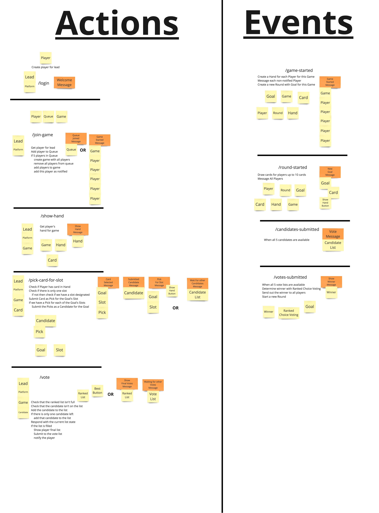

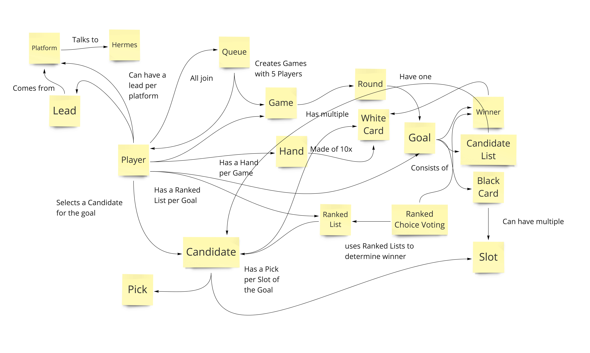

## #23

Started the next block doing more domain design. Finished up the actions and
events and then got started on figuring the relationships between each domain
object explicitly. Once the relationships are figured out then I can work on the
core data structure for everything.

## #22

More in-depth domain design. About halfway through the design at this point and
have a good amount of coverage on the events/actions that are happening in the
system So far it has filled in a lot of implementation gaps. Off to breakfast.

## #21

Started diving a lot deeper into domain design, observing what kind of actions
are needed, what kind of domain objects are involved in each piece of the
system, as well as how they relate to each other. Still lots to go.

## #20

Started working on engineering the domain for the game and how it interacts with
outside platforms like Facebook. This will be important for ensuring that we
test the right things and we keep the logic in the right places. Quick break.

## #19

Back to coding today. I started out by fixing a major issue where messages were
all sent at the same time and as a result did not show up in the right order. So
I implemented a solution I found here:
https://hackernoon.com/functional-javascript-resolving-promises-sequentially-7aac18c4431e,
and it worked like a charm. Then I did a bit of refactoring to clean it up.
Today I need to spend a lot of time on planning out the engineering effort and
separating Facebook rendering responsibilities from the actual domain itself. I
have to think of this in terms of the domain being its own server. Even though I
won't be splitting it off since I'm running small efficient nanoservices. Time
for a break.

## #18

WOOT!!! I finally got the visuals mostly done all the way through for all of the
major actions and events. Now I can just clean up the Facebook library and start
working on the actual domain logic that will support all of this. Tomorrow will
be a good day and I'll have a very powerful visual system already setup for all
of this. WOOT!!!

Here are a couple of shots from mobile (ignore the order of the messages):

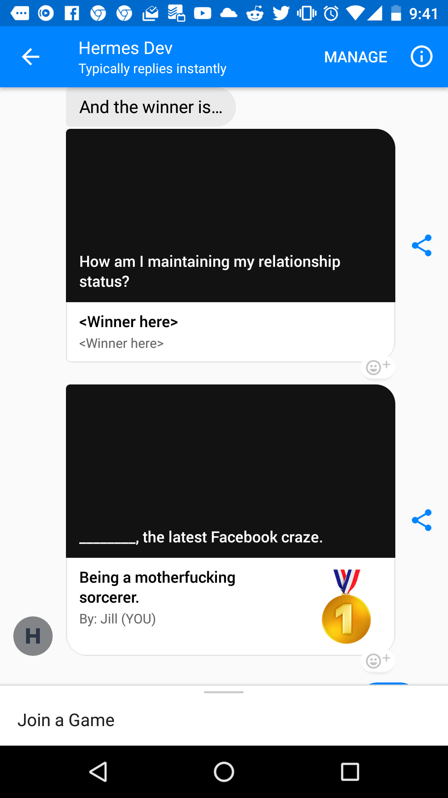
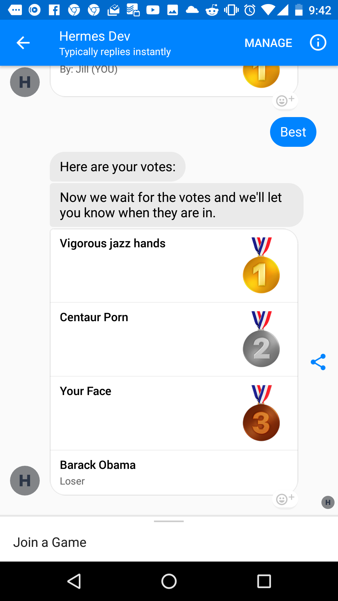

## #17

Finished up the work for the carousel for showing a hand. Took a little bit to
realize that I was messing up syntax somewhere, but I got it. Next will be
tackling the two different kinds of lists at the same time and hopefully
finishing up the visuals for all of the actions.

## #16

Finally got the generic card to work for when you are picking a card. Now I need
to start work on the list template, cuz that one is crucial for the goal and the
voting. So that is my next target.

## #15

Setup the placeholder messages for the various actions. Also figured out how to
setup a persitent menu. I now need to setup support for an array of messages or
a single object. Then I can split up the placeholder system without using double
new lines.

## #14

I setup proper recognition of some postbacks and quick replies now. This will
give me some flexibility in how I trigger the visuals for these messages. Right
now the goal is to have all the pretty pictures done hopefully in a session or
two and then we can start playing with the domain.

## #13

Got the Facebook endpoints working smoothly and now I'm ready to start sending
mocked Facebook messages based on actions. Shouldn't be too bad, but I haven't
worked with persistent menus or the getting started button yet, so I may hit a
couple roadblocks.

## #12

I was going to setup the firebase server local database, but it ultimately
didn't work out. I couldn't get the server to be recognized by my local running
function so for now I'm just gonna call it good. I'll just move on to doing
Facebook integration.

## #11

Setup the node project for the functions. Set it up to work with a new firebase
project. Also setup a script to easily run the functions locally while also
refreshing for any changes that are made. Next is to setup a local firebase
database and also setup the facebook endpoint to get to work.

## #10

Finished up the last of the design for the interface. Including the winner
presentation and the next goal. Everything should be good to go for jumping into
coding now. So after a long break I'm going to jump back on and start working on
the minimal portion of interacting with Facebook. But first a really long break.

Final first draft of the interface:

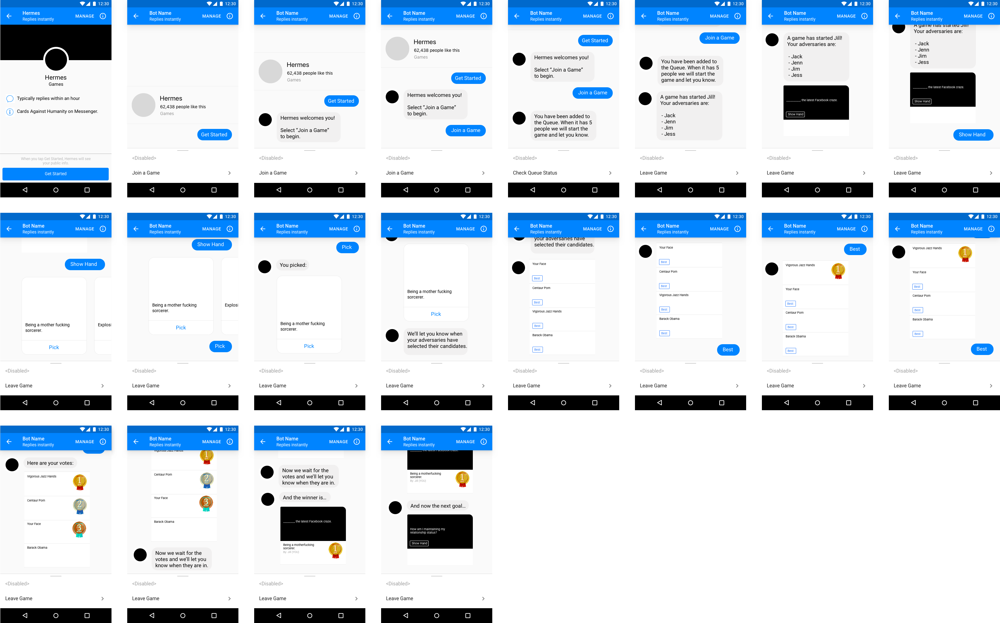

## #9

Finally created the voting list symbol and started going through the whole
voting flow. Shouldn't be long to finish the remaining votes and then it is just
a matter of handling the winner and showing a new goal. After that it should be
good.

Current progress:

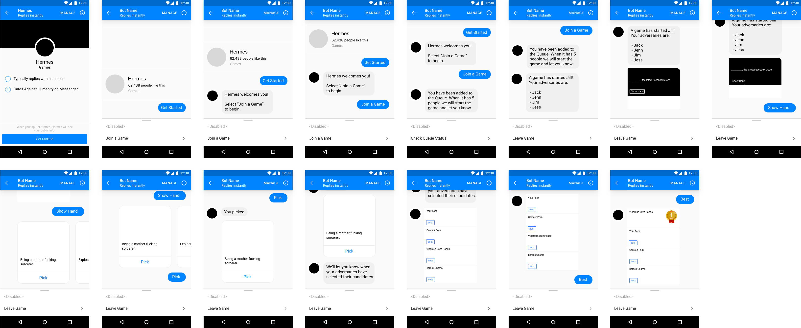

## #8

Created the items for the goal list as well as the carousel items for white
cards to be used and added a couple more steps to the flow. Next I'll have to
start tackling the voting system flow and then the winner portion. And that
should be it. So 1 or two more sessions as I guess.

Current progress:

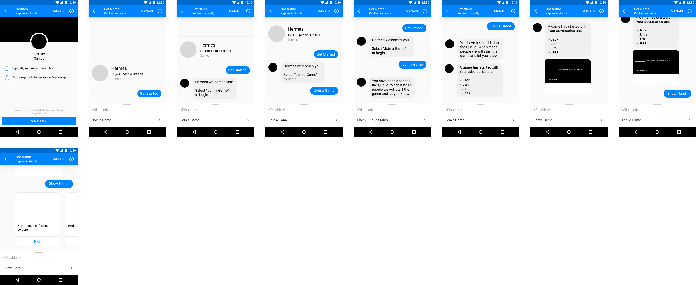

## #7

Created most of the flow up until I needed custom messages for the goal. So now
I'm creating the symbols needed for the different containers of data. Making
solid progress though. Probably 3 more sessions for interface design.

Current progress:

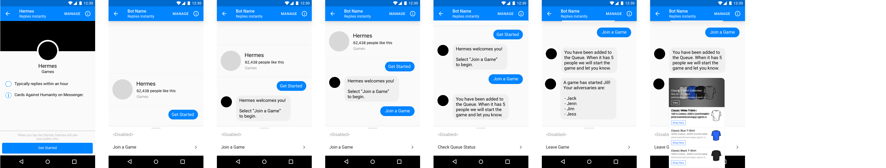

## #6

I've officially started the interface design. I had to build the base templates
for the android interface including the get started page and more. But next
session I'm good to start creating the flow of the interface.

The initial work for the interface design:

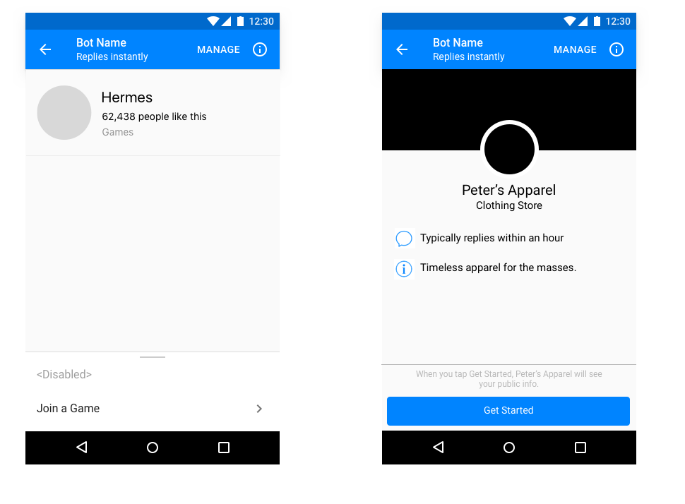

## #5

Finished up the last of the use cases for the domain and now I'm making plans
for the interface design process. Should be a good time. I will have to probably
create the list template, the message bubbles, the getting started page, and a
few other things to really do it right.

Below is the final first draft of use cases:

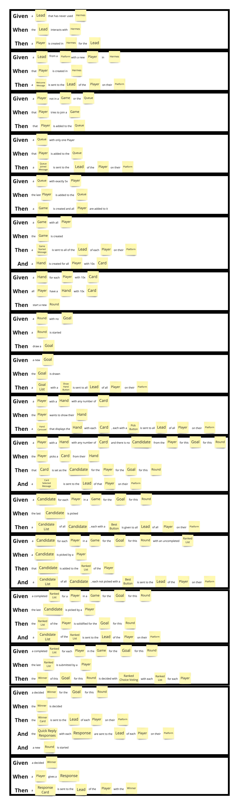

## #4

Got through a good portion of the voting process and just need to finish up the
final portion so we can start on interface design. Still lots to do for the
product side of things, but it is necessary before we start coding so we have a
clear direction moving forward and everything is sort of pre-thought out.

Current progress on the use cases:

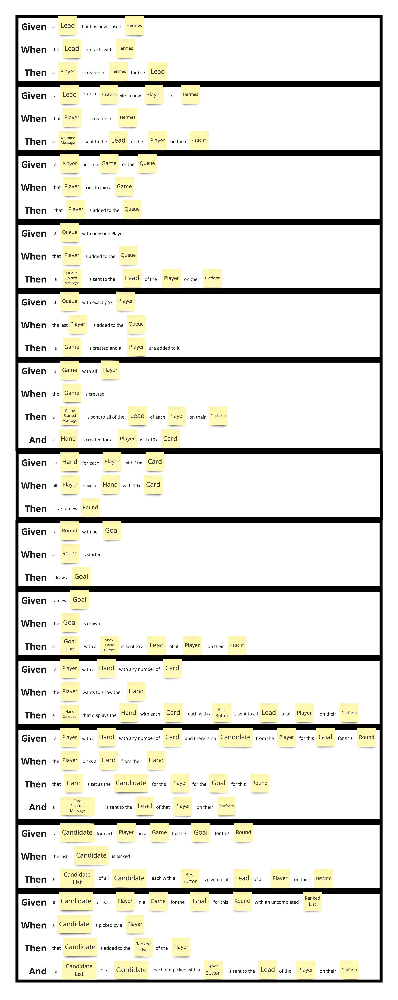

## #3

So I realized during my walk that I needed to re-think how I was creating the
use cases. The use cases should really be around the platform/domain not around
the interface itself. That will be what the interface design is for. So I made
some solid progress on starting up a game and am working towards the use cases
revolving around actual play. Shouldn't take me more than 2 more sessions to
finish up the use case design. Which after that I'll probably take a break for
Breakfast and then after Breakfast I'll tackle interface design. And hopefully
finish interface design by Lunch time and then start the initial coding after
Lunch.

Current progress on the new use cases:

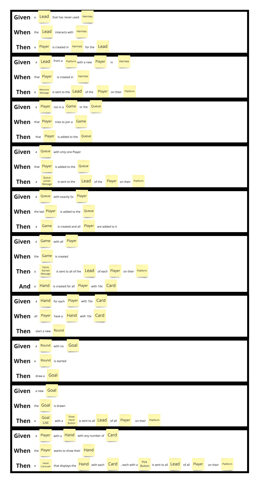

## #2

So I organized all of the brainstorming ideas that I had into Product,
Technology, and Executive groups. Then I started working on the use cases. It is
going to prove to be a fairly long process as it is a mix of both UI interaction
for the user and domain management.

Current progress on use cases:

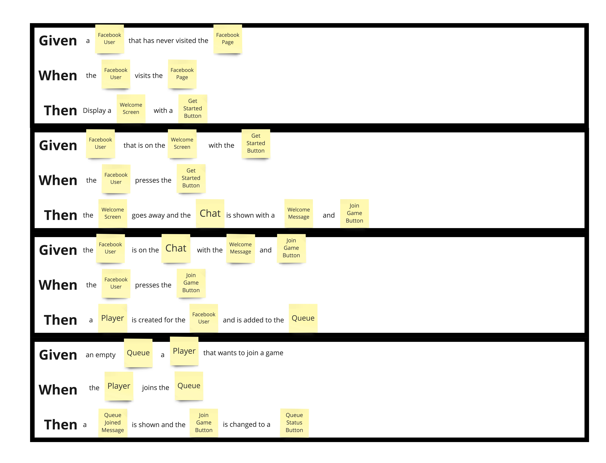

## #1

I started out with a brainstorming session for Hermes. Setup the initial
directory structure for the project to track all artifacts and code. Getting
ready to start working on the use case design after brainstorm organization.

Here is a snapshot of the brainstorming:

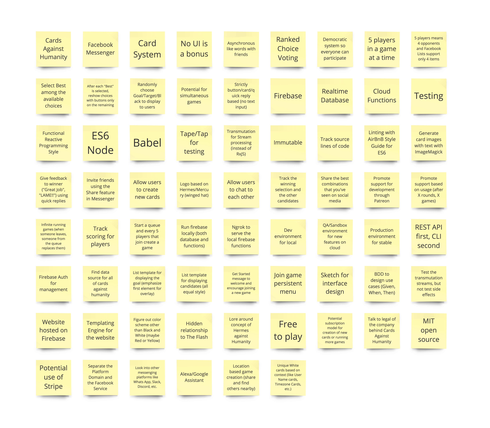
